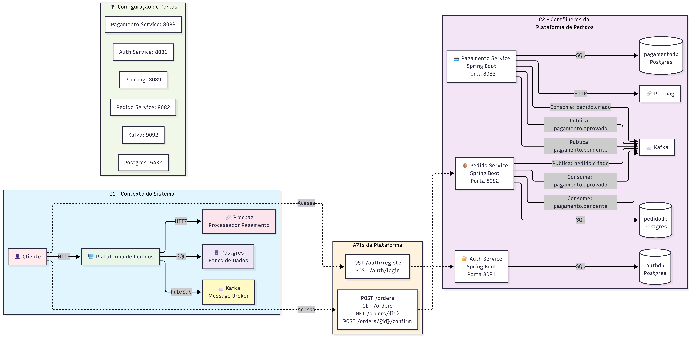

# Tech Challenger — Fase 03 — Documentação da Aplicação


> Uma arquitetura de microserviços demonstrando autenticação com JWT, mensageria com Kafka e integração com um serviço externo de pagamento.

Índice
- [Visão Geral](#visão-geral)
- [Arquitetura](#arquitetura)
- [Como subir o ambiente](#como-subir-o-ambiente)
- [Serviços e portas](#serviços-e-portas)
- [Rotas HTTP principais](#rotas-http-principais)
- [Tópicos Kafka](#tópicos-kafka)
- [Exemplos de chamadas (cURL)](#exemplos-de-chamadas-curl)
---

Visão Geral
----------
Este repositório do Tech Challenger da fase 3 da FIAP contém uma arquitetura de microserviços para autenticação, pedidos e pagamentos.
O objetivo é demonstrar separação de responsabilidades, comunicação assíncrona com Kafka e integração com um serviço externo de pagamento.

Arquitetura
----------
- auth-service (porta 8081)
  - Autenticação e cadastro de usuários. Emite JWT usado pelos demais serviços.
- pedido-service (porta 8082)
  - Gerencia pedidos. Exige JWT válido e publica eventos em Kafka.
- pagamento-service (porta 8083)
  - Processa pagamentos de forma assíncrona. Não expõe rotas HTTP públicas.
- procpag (porta 8089)
  - Serviço externo de processamento de pagamentos (imagem Docker). OpenAPI em `http://localhost:8089/openapi.yml`.
- postgres (porta 5432)
  - Banco compartilhado com bancos lógicos separados (authdb, pedidodb, pagamentodb).
- kafka (porta 9092) + kafka-ui (porta 8085)
  - Mensageria para eventos de pedido e pagamento.

Padrão de camadas (por serviço)
1. application — casos de uso e DTOs
2. domain — entidades e regras de negócio
3. infrastructure — controllers HTTP, persistência, mensageria, mappers e configs

Como subir o ambiente
--------------------
Recomendado: docker e docker-compose instalados.

No diretório raiz do projeto:

```bash
docker compose up -d --build
```

Isso irá construir e subir todos os serviços listados em segundos.

Serviços e portas
-----------------
- auth-service -> http://localhost:8081
- pedido-service -> http://localhost:8082
- pagamento-service -> http://localhost:8083
- procpag -> http://localhost:8089
- kafka-ui -> http://localhost:8085

Rotas HTTP principais
---------------------
auth-service (8081)
- POST /auth/register — Cria um usuário.
- POST /auth/login — Autentica e retorna JWT.

pedido-service (8082) — todas as rotas exigem header `Authorization: Bearer <token>`
- POST /orders — Cria um pedido.
- GET /orders — Lista pedidos do usuário autenticado.
- GET /orders/{id} — Busca pedido por id (apenas do usuário proprietário).
- POST /orders/{id}/confirm — Confirma pedido.

pagamento-service (8083)
- Não possui endpoints HTTP públicos. Processamento ocorre via Kafka.

Tópicos Kafka
-------------
- pedido.criado — Publicado pelo `pedido-service`. Consumido pelo `pagamento-service`.
- pagamento.aprovado — Publicado pelo `pagamento-service`. Consumido pelo `pedido-service`.
- pagamento.pendente — Publicado pelo `pagamento-service`. Consumido pelo `pedido-service`.

Exemplos de chamadas (cURL)
---------------------------
1) Registrar usuário

```bash
curl -X POST http://localhost:8081/auth/register \
  -H "Content-Type: application/json" \
  -d '{
    "name": "Joao Silva",
    "email": "joao@exemplo.com",
    "password": "senha123"
  }'
```

2) Login

```bash
curl -X POST http://localhost:8081/auth/login \
  -H "Content-Type: application/json" \
  -d '{
    "email": "joao@exemplo.com",
    "password": "senha123"
  }'
```
Resposta esperada (exemplo):

```json
{
  "token": "eyJhbGciOi...",
  "type": "Bearer",
  "userId": 1,
  "email": "joao@exemplo.com",
  "role": "CUSTOMER"
}
```

3) Criar pedido

```bash
curl -X POST http://localhost:8082/orders \
  -H "Content-Type: application/json" \
  -H "Authorization: Bearer <TOKEN_AQUI>" \
  -d '{
    "restaurant": {
      "restaurantId": 10,
      "restaurantName": "Restaurante Central"
    },
    "items": [
      { "productId": 1, "name": "Hamburguer", "quantity": 2, "price": 25.90 },
      { "productId": 2, "name": "Refrigerante", "quantity": 1, "price": 6.50 }
    ]
  }'
```

4) Listar meus pedidos

```bash
curl -X GET http://localhost:8082/orders \
  -H "Authorization: Bearer <TOKEN_AQUI>"
```

5) Buscar pedido por id

```bash
curl -X GET http://localhost:8082/orders/1 \
  -H "Authorization: Bearer <TOKEN_AQUI>"
```

6) Confirmar pedido

```bash
curl -X POST http://localhost:8082/orders/1/confirm \
  -H "Authorization: Bearer <TOKEN_AQUI>"
```

Observações técnicas
-------------------
- JWT é obrigatório no `pedido-service` (todas as rotas, exceto Swagger).
- O `pagamento-service` integra com o `procpag` via HTTP e possui resiliência com Resilience4j.
- `kafka-ui` facilita inspeção de tópicos e mensagens.

Arquitetura detalhada
---------------------

## Diagrama de sequência


## Diagrama C4 Model



Fluxo principal (descrição passo a passo)
-----------------------------------------
- Autenticacao
  1. Usuario se cadastra ou realiza login no `auth-service`.
  2. `auth-service` devolve um JWT (token, tipo, userId, email, role).

- Criacao de pedido
  1. Cliente envia POST /orders ao `pedido-service` com JWT no header.
  2. `pedido-service` valida JWT localmente e autoriza a acao.
  3. Pedido e persistido com status inicial AGUARDANDO_CONFIRMACAO.

- Confirmacao do pedido
  1. Cliente envia POST /orders/{id}/confirm.
  2. `pedido-service` valida se o pedido pertence ao usuario e se o status permite confirmacao.
  3. Status muda para CRIADO.
  4. `pedido-service` publica evento `pedido.criado` no Kafka com `orderId`, `customerId` , `totalAmount` ,`items`, `status` e `restaurantData`.

- Processamento de pagamento (assincrono)
  1. `pagamento-service` consome `pedido.criado`.
  2. Cria pagamento com status PENDENTE e chama `procpag` (HTTP).
  3. Em caso de sucesso, publica `pagamento.aprovado`.
  4. Em caso de erro/excecao, publica `pagamento.pendente`.
  5. `pedido-service` consome o evento e atualiza o status do pedido.

Pontos de resiliência
--------------------------------------------------
Abaixo estão as estratégias implementadas para resilência.

- Circuit Breaker (Resilience4j) com `sliding-window-size=4`, `minimum-number-of-calls=2`, `failure-rate-threshold=10`, `wait-duration-in-open-state=60s`.
- Retry com `max-attempts=3` e `wait-duration=2s`.
- Timeout por tentativa de 3 segundos.
- Fallback
